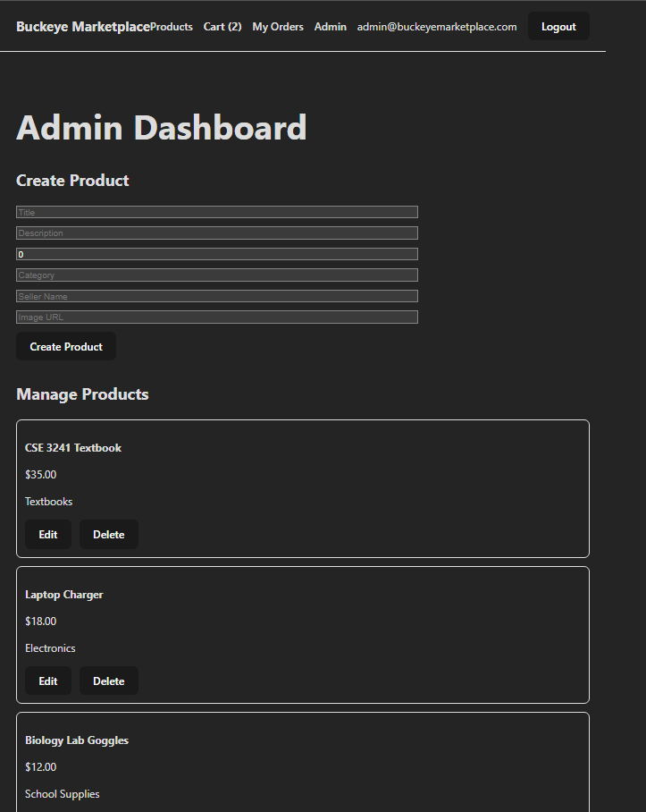
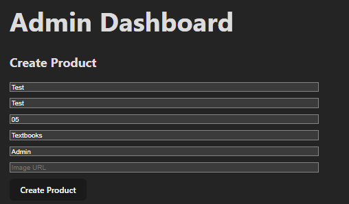
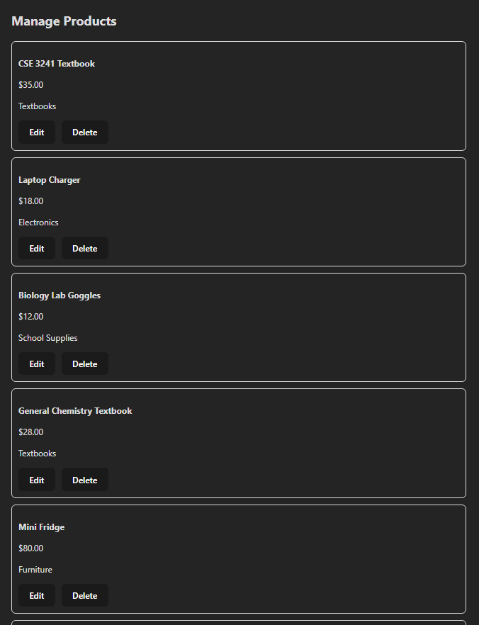
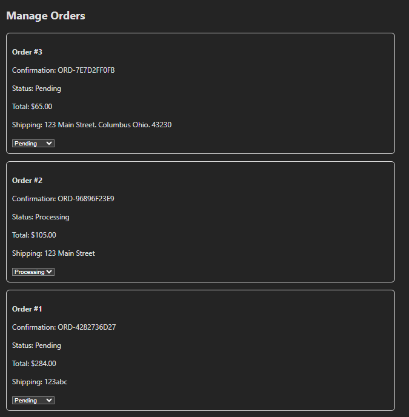

# Buckeye Marketplace — Admin Guide

This guide is for users with the **Admin** role. Admins have all the abilities of a regular user (browsing, cart, ordering) plus the ability to manage the product catalog and update order statuses for any user.

**Live site:** https://agreeable-mushroom-0fcb93e0f.7.azurestaticapps.net

**Default admin credentials:** `admin@buckeyemarketplace.com` / `Admin123`

---

## Logging In as Admin

Sign in with the admin credentials above (or any account that has been granted the Admin role on the backend). After login, an additional **Admin** link appears in the navigation bar that is not visible to regular users.

Click **Admin** to open the admin dashboard.

The dashboard has three main sections:

1. **Create / Edit Product form** at the top
2. **Manage Products** section listing every product with edit and delete controls
3. **Manage Orders** section listing every order across all users with a status dropdown for each

If you ever see "Access denied" or get redirected away from `/admin`, your account does not have the Admin role. Only users assigned the Admin role on the backend can use this dashboard.

---

## 1. Managing Products

### Creating a new product

In the **Create Product** form at the top of the dashboard, fill in:

- **Title** — short, descriptive name of the item
- **Description** — longer explanation of condition, features, etc.
- **Price** — numeric USD value
- **Category** — Textbooks, Electronics, Furniture, School Supplies, etc.
- **Seller Name** — the display name to associate with the listing
- **Image URL** — relative path (e.g. `/images/textbook1.jpg`) or full URL to the product image

Click **Create Product**. The new product appears in the **Manage Products** list immediately and on the public products page for all users.

### Editing an existing product

In the **Manage Products** section, find the product you want to edit and click the **Edit** button.

The form at the top of the page becomes an Edit form, pre-populated with the existing product's values. Modify any fields and click **Save Changes** to update. Click **Cancel Edit** to discard changes and return to create mode.

### Deleting a product

In the **Manage Products** section, click the **Delete** button next to any product. The product is removed from the catalog and no longer visible to users.

> Note: products that already appear in someone's cart or in a placed order will not be deleted from those records, since the order history must remain accurate. Cart and order items reference products with `DeleteBehavior.Restrict`, so the database will reject the delete if the product is still actively used. If a delete fails, ask the user to clear the item from their cart first, or leave the product in place.

---

## 2. Managing Orders

The **Manage Orders** section lists every order placed across the entire platform, regardless of which user placed it.

For each order you can see:

- **Order number** and **confirmation number**
- **Status** (current state of fulfillment)
- **Total**
- **Shipping address**
- **A status dropdown** to change the state

### Updating an order's status

Click the status dropdown for any order and select a new status:

- **Pending** — the default state when an order is first placed
- **Processing** — the order is being prepared
- **Shipped** — the order has been shipped to the customer
- **Delivered** — the order has reached the customer

When you select a new value, the change is saved automatically. The user who placed the order will see the new status the next time they view their order history.

There is no "delete order" option, by design. Orders are part of the user's permanent record and are never removed from the system.

---

## Quick Reference

| Task | Where | Action |
| --- | --- | --- |
| Add a product | Create Product form (top) | Fill form, click "Create Product" |
| Edit a product | Manage Products section | Click "Edit" on the product, modify form, click "Save Changes" |
| Delete a product | Manage Products section | Click "Delete" on the product |
| Update order status | Manage Orders section | Choose a new value from the status dropdown |