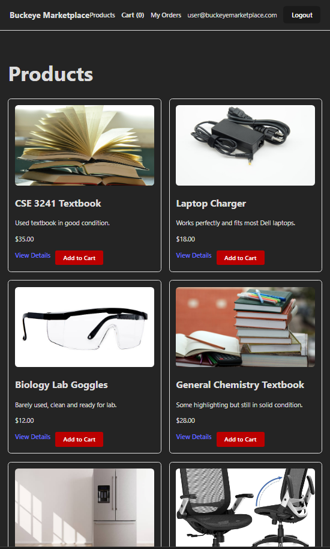
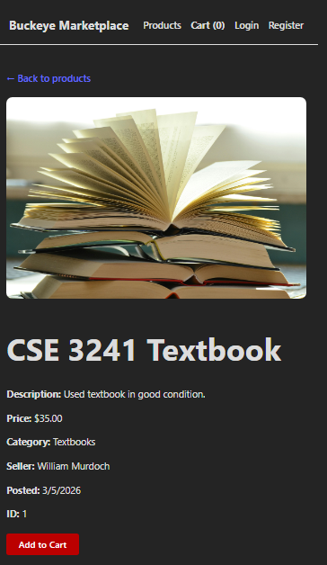
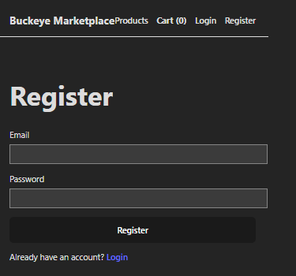
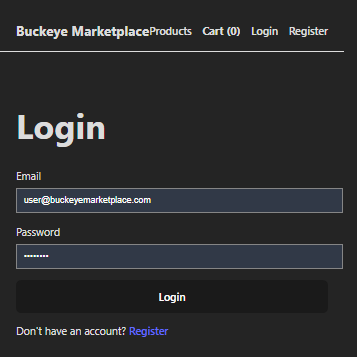
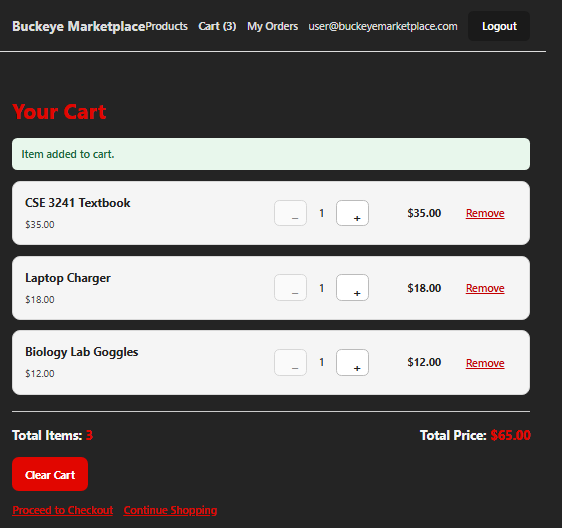
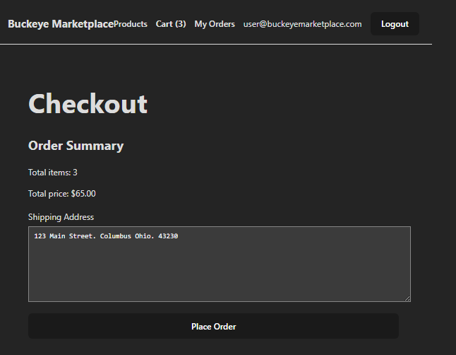
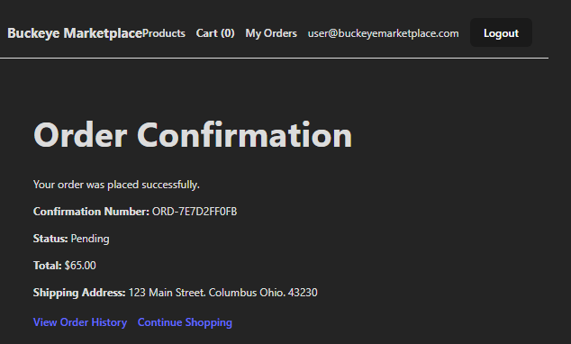
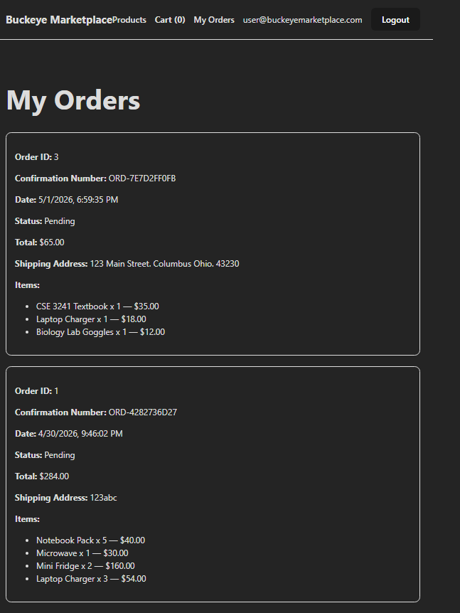

# Buckeye Marketplace — User Guide

Welcome to Buckeye Marketplace, a campus-only marketplace for OSU students to buy and sell items. This guide walks you through every action you can take as a regular user, from browsing the catalog to viewing your past orders.

**Live site:** https://agreeable-mushroom-0fcb93e0f.7.azurestaticapps.net

---

## 1. Browsing Products

When you first visit Buckeye Marketplace, you land on the product catalog. You do not need to be logged in to browse.

Each product card displays:

- **Product image**
- **Title** (the item being sold)
- **Price** in USD
- **Category** (Textbooks, Electronics, Furniture, School Supplies)
- **Seller name** (the OSU student who listed the item)
- **"View Details"** link
- **"Add to Cart"** button

### Viewing product details

Click any product card or the "View Details" link to see the full product page.

The detail page shows the same information plus a longer description and the date the item was posted. From this page you can add the item to your cart at any quantity.

---

## 2. Creating an Account

You need an account to add items to your cart, place orders, or view your order history.

### Register

From the navigation bar, click **Register**.

Enter:

- **Email** — must be a valid email format
- **Password** — must be at least 8 characters and include both a digit and an uppercase letter

After submitting, you are redirected to the login page.

### Login

Enter the email and password you registered with. After successful login you are returned to the homepage, and the navigation bar updates to show your account email and a Logout button.

If you forget your credentials, you must register a new account — there is no password reset flow in the current version.

---

## 3. Adding Items to Your Cart

You must be logged in to add items to your cart.

From either the products page or a product detail page, click the **Add to Cart** button. The cart count in the navigation bar updates immediately to reflect the new item.

To view or modify your cart, click the **Cart** link in the navigation bar.

On the cart page you can:

- **Change quantity** of any item using the quantity input
- **Remove an item** with the Remove button
- **See your subtotal and total** updated automatically as you make changes
- **Proceed to checkout** with the Checkout button

Your cart is saved to your account, so it persists across sessions and devices. If you log out and log back in later, your cart will still be there.

---

## 4. Placing an Order

When you are ready to check out, click **Checkout** from the cart page.

Fill in your **shipping address** and review the order summary. The summary lists every item in your cart, the per-item price, and the order total.

Click **Place Order** to submit. The cart is cleared automatically once the order is placed successfully.

After a successful order you are redirected to the order confirmation page.

The confirmation page shows your unique **confirmation number** — save this for your records. You can also see the order total, items, status (initially "Pending"), and the shipping address you provided.

---

## 5. Viewing Your Order History

To see all the orders you have placed, click **My Orders** in the navigation bar.

Your order history lists every order you have placed, most recent first. Each entry shows:

- **Order number and confirmation number**
- **Date placed**
- **Status** (Pending, Processing, Shipped, or Delivered — updated by an admin as your order progresses)
- **Total**
- **Items in the order**
- **Shipping address used**

Only your own orders are visible here. The order history endpoint resolves the current user from your authentication token, so even with a guessed URL another user cannot view your orders.

---

## Logging Out

Click the **Logout** button in the navigation bar. You are returned to the public products page, and your session is ended.

Your cart, account, and orders are preserved — they will be available the next time you log in with the same credentials.

---

## Need Help?

If something is not working as described in this guide, please:

1. Refresh the page (the app uses a free-tier cloud backend that occasionally cold-starts after periods of inactivity, taking up to 30 seconds for the first request).
2. Make sure you are logged in for any feature that requires an account (cart, checkout, order history).
3. Contact the project author at the email associated with the OSU GitHub account `jaabirelmi`.